# Scalac recruitment task
## General info

All tasks resolved using AWS sandbox, that's why I didn't remove access or secret keys. :) 

## Table od contents

* [Task one - bash-api](#task-one---bash-api)
* [Task two - Terraform](#task-two---terraform)
* [Task three - k8s](#task-three---k8s)
* [Task four - GitHub Actions](#task-four---github-actions)
* [Task five - helm](#task-five---helm)

## Task one - bash-api

> Create a microservice serving REST API with GET calls returning 100jokes starting from the newest from bash.org.pl in JSON format.

I resolved this task by scraping http://bash.org.pl with *BeautifulSoup* and then building an API with *FastAPI*. All
the code can be found in *./bash-api* directory. To run this script just follow these steps:

```commandline
pip install -r ./bash-api/requirements.txt
cd bash-api
uvicorn main:app --reload
```

Once you see `Uvicorn running on http://127.0.0.1:8000` you are good to check your API.

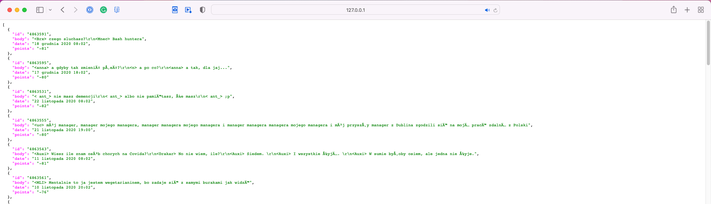

I decided to add one more API endpoint for individual jokes. It can be accessed by adding an ID to the address.

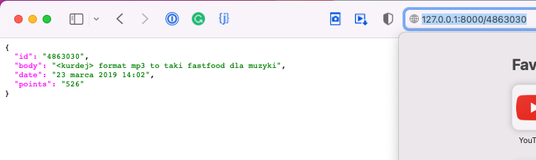

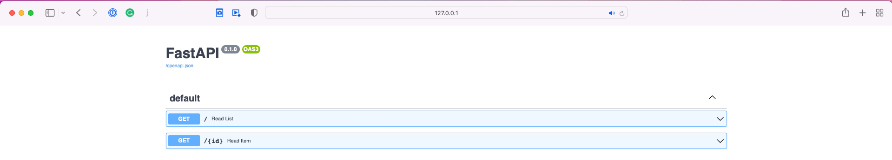

## Task two - Terraform

> Prepare code for an Amazon EKS Cluster creation using Terraform.

Files for this task are saved in *./eks* folder. Before we trigger our deploy, we have to configure a few things. First
of all make sure that configuration in *./eks/provider.tf* and *AWS CLI* is matching credentials from *Identity and
Access Management (IAM)*.

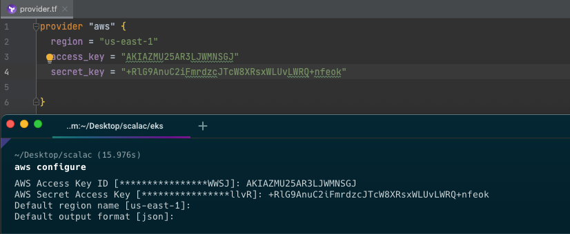

Then check if subnet IDs in *./eks/eks.tf* are matching ones from *VPC*.

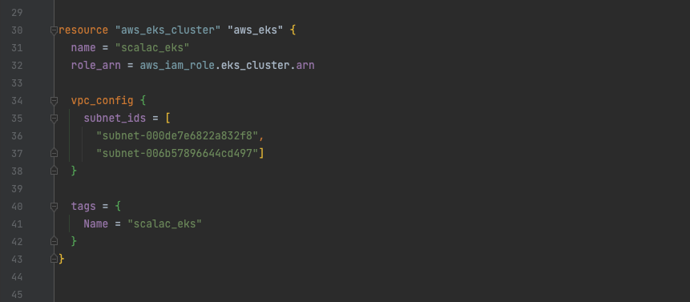

Note that there are two IDs to provide in two different places. Lines 36, 37 and 86, 87.

Now we are ready to start a deployment. Execute commands:

```commandline
cd eks/
terraform init
terraform plan
terraform apply --auto-approve
```

If everything completed successfully, we should see a prompt:

`Apply complete! Resources: 9 added, 0 changed, 0 destroyed.`

and our EKS is ready:

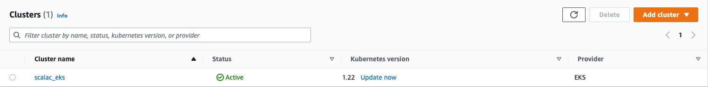

## Task three - k8s

> Prepare code that creates necessary kubernetes objects to run the created service inside a kubernetes cluster. It may be done with simple manifests but using Kustomize will result in bonus points.

To deploy an app to run in a k8s cluster, we have to configure an ERC which requires container image. So lets build one:

```commandline
cd bash-api/
docker build --platform linux/amd64 -t api-bash .
aws ecr create-repository --repository-name api-bash --region us-east-1
```

Now note down URI of the repository we just created, it will be needed to push the image. In my case it
was `645643699318.dkr.ecr.us-east-1.amazonaws.com/api-bash`. But it will differ for others.

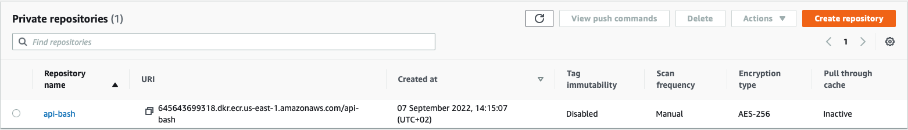

Now Docker login and pushing the image

```commandline
docker tag api-bash:latest <repo_uri>/api-bash:latest
aws ecr get-login-password --region us-east-1
aws ecr --regions us-east-1 | docker login -u AWS -p <password_from_above> <repo_uri>/api-bash:latest
docker push <repo_uri>/api-bash:latest
```

At this point we should see our image in api-bash repo, and finally we can get to the k8s.

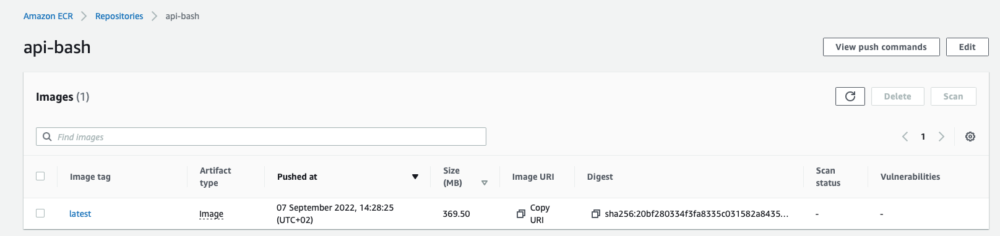

We need two files to deploy our service - *deployment.yaml* and *service.yaml*. Both can be found in the k8s folder.
Only thing to be updated is image URI in *deployment.yaml*, line 18.

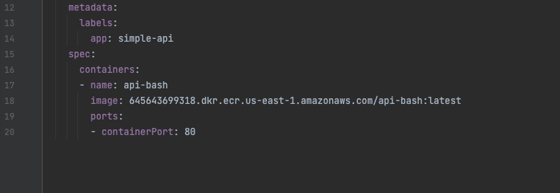

Now simply execute the following commands (from the k8s folder):

```commandline
aws eks --region us-east-1 update-kubeconfig --name scalac_eks
kubectl apply -f deployment.yaml
kubectl apply -f service.yaml
```

Now the service should be running in our EKS. To get it's IP simply execute `kubectl get services`

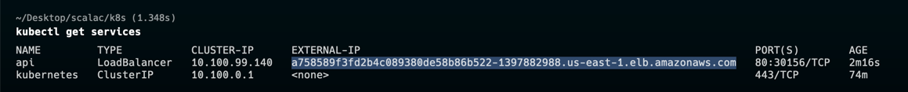

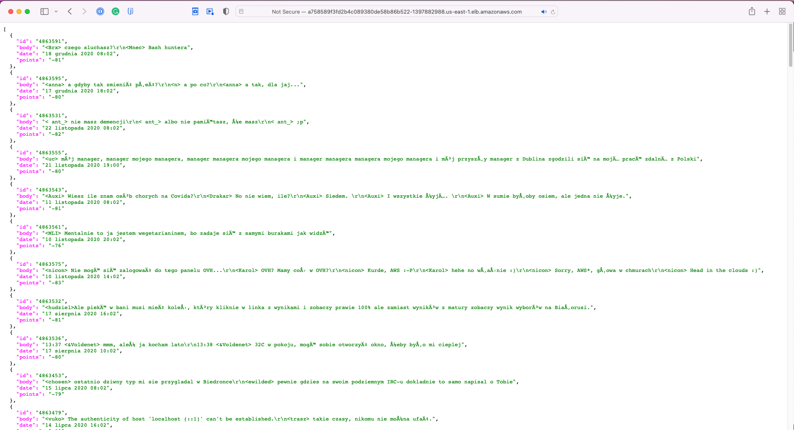

## Task four - GitHub Actions

> Prepare an on-demand deployment of the created application to the cluster inside Github Actions, based on a branch choice.

## Task five - helm

> Create a helm chart for the created application deployment.

Files needed for this one are saved in *./chart* folder and only thing to be changed is repo URI in *values.yaml* file.
As helm is already created, we can skip this step and jump straight to install:
```commandline
cd chart/
helm install bash-api-chart bash-api-chart/ --values bash-api-chart/values.yaml
```
To get an external IP of just deployed service execute the command:

```commandline
kubectl get --namespace default svc -w bash-api-chart
```

In my case it was `a93eed3773bdc4bcca2d263f8f8cc144-1089964807.us-east-1.elb.amazonaws.com`.

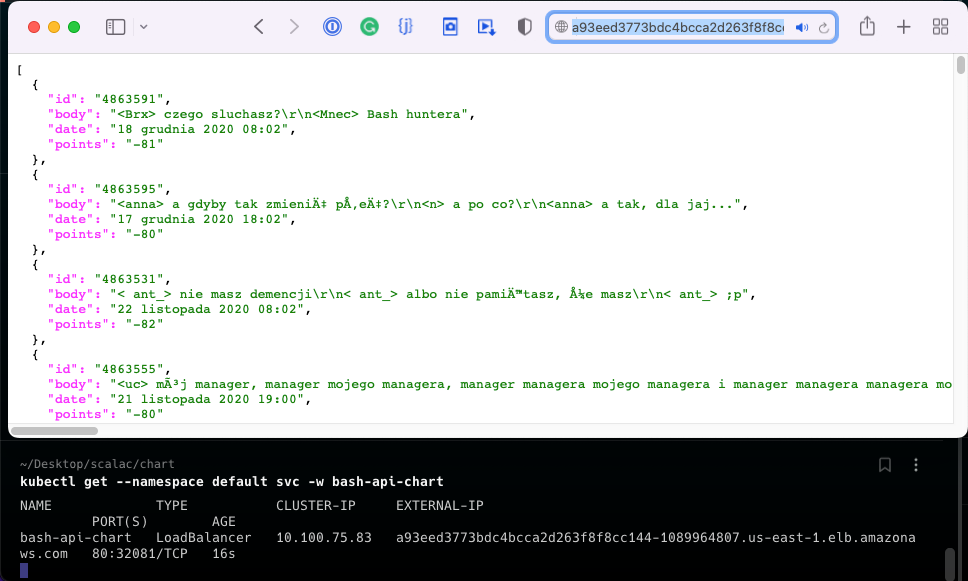